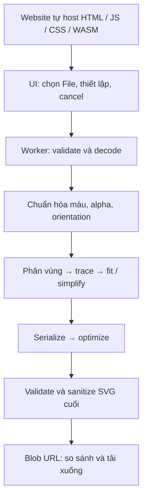

# Nghiên cứu kỹ thuật chuyển PNG/JPG thành SVG hoàn toàn trong trình duyệt

**Cập nhật sau R&D:** [Báo cáo tổng hợp, đối chiếu năm chuyên đề và bằng chứng browser](/Users/dongnt/Desktop/github/svg/docs/research/browser-vectorization-rd-synthesis.vi.md) là tài liệu quyết định chi tiết mới nhất. Phần kỹ thuật bên dưới đã bổ sung các kết luận có cơ sở; những tính năng chưa được kiểm chứng vẫn được ghi là R&D.

**Kết luận: khả thi về nơi xử lý; không thể bảo đảm độ chính xác tuyệt đối cho mọi ảnh phức tạp đồng thời giữ SVG mượt, gọn và dễ chỉnh sửa.** Hướng phù hợp là WebAssembly trong Web Worker, bắt đầu với engine tracing có sẵn, rồi kiểm chứng chất lượng theo từng nhóm ảnh. Gradient và alpha mềm là hai khoảng trống lớn cần giải quyết trước khi quảng bá hỗ trợ ảnh phức tạp với độ trung thực cao.

Phạm vi đánh giá là PNG, JPG/JPEG đầu vào; SVG đầu ra gồm hình học vector thật; không nhúng raster và không truyền ảnh tới dịch vụ chuyển đổi. Thông tin thư viện và nguồn được đối chiếu đến ngày **14/09/2026**. Đã bổ sung phép thử browser nhỏ với sáu fixture tổng hợp và một phản ví dụ phục hồi SVG; chưa chạy benchmark trên bộ ảnh thực tế hoặc mobile. Các giới hạn triển khai bên dưới là đề xuất để kiểm nghiệm, không phải thông số đã đạt.

## 1. Mức độ khả thi của yêu cầu

| Yêu cầu | Đánh giá | Điều kiện thực tế |
| --- | --- | --- |
| Đọc PNG/JPG và chuyển đổi trên thiết bị | Khả thi | Browser decode hoặc decoder WASM, engine chạy trong worker |
| Không gọi API chuyển đổi, không upload ảnh | Khả thi | Tự host mã JS/WASM; pipeline chỉ sử dụng dữ liệu cục bộ |
| Tiếp tục chuyển đổi khi mất mạng | Khả thi | Tải đủ engine trước khi báo sẵn sàng; nếu cần mở lại website offline thì cache tài nguyên ứng dụng |
| Xuất SVG có đường vector chỉnh sửa được | Khả thi | Trace thành path/shape; kiểm tra đầu ra không có raster nhúng |
| Giữ rất sát logo và hình nhiều mảng màu rõ | Có triển vọng tốt | Nguồn đủ chi tiết; chỉnh tham số và xác nhận bằng bộ kiểm thử |
| Giữ rất sát illustration có gradient, bóng và alpha mềm | Khả thi có điều kiện, cần R&D | Phải mô hình hóa gradient/opacity và xử lý biên đúng |
| Ảnh chụp bất kỳ → SVG nhỏ, đẹp, giống tuyệt đối | Không khả thi như bảo đảm tổng quát trong budget nhỏ | Giới hạn thông tin khi miền ảnh không giới hạn độ phức tạp; không phủ định một số ảnh có nghiệm gọn |
| Phục hồi đúng SVG gốc từ PNG/JPG bất kỳ | Không khả thi như phép phục hồi duy nhất | Có phản ví dụ hai nguồn SVG khác nhau tạo PNG/JPEG giống từng byte |

Nền tảng browser có các khối cần thiết: `createImageBitmap()` trong worker và `OffscreenCanvas` để giải mã, đọc và xử lý pixel. Vì vậy không cần backend chuyển đổi chỉ để thực hiện tracing. [1 – MDN createImageBitmap](https://developer.mozilla.org/en-US/docs/Web/API/WorkerGlobalScope/createImageBitmap), [2 – MDN OffscreenCanvas](https://developer.mozilla.org/en-US/docs/Web/API/OffscreenCanvas).

## 2. “Chính xác tuyệt đối” phải được định nghĩa lại

Cần phân biệt ba mục tiêu: giống ảnh khi render ở kích thước gốc; đường nét hợp lý khi phóng lớn; cấu trúc dễ chỉnh sửa theo đối tượng. Một SVG có hàng trăm nghìn mảnh màu có thể gần pixel gốc nhưng rất khó chỉnh sửa. Một SVG chỉ có vài chục đường mượt có thể đẹp nhưng bỏ mất chi tiết. Không có một chỉ số duy nhất thay thế được cả ba mục tiêu.

Về mặt thông tin, rasterization là quá trình nhiều-một: những đường hoặc cấu trúc layer khác nhau có thể tạo cùng mẫu pixel. Chẳng hạn, phần hình học nằm hoàn toàn sau một hình đục không thể suy ra từ ảnh cuối. Đây là suy luận về bài toán nghịch đảo, không phải giới hạn riêng của JavaScript. PNG lưu được dữ liệu ảnh không mất mát nhưng điều đó không biến PNG thành nơi lưu cấu trúc vector. [3 – W3C PNG](https://www.w3.org/TR/png-3/).

JPEG thông dụng dùng nén DCT có mất mát, bổ sung một nguồn sai lệch trước khi tracing bắt đầu. Cần phân biệt việc bám sát JPEG đã giải mã với việc khôi phục hình thiết kế trước khi nén; mục tiêu thứ hai cần suy đoán. Tiêu chuẩn JPEG còn có các chế độ lossless khác, vì vậy không nên khẳng định mọi biến thể JPEG đều mất mát. [4 – ITU-T T.81, mục 4.2–4.3](https://www.w3.org/Graphics/JPEG/itu-t81.pdf).

Có hai cách tạo file đuôi SVG nhưng không giải quyết nhu cầu sản phẩm:

- Nhúng PNG/JPG bằng `<image>`: giữ ảnh raster, không tạo các đối tượng vector tương ứng.
- Biểu diễn mỗi pixel bằng một ô vector: về nguyên lý có thể tái hiện lưới màu/alpha trong điều kiện render phù hợp, nhưng ảnh 2.000 × 2.000 có thể cần tới bốn triệu ô. Phóng lớn vẫn thấy cấu trúc pixel; không phục hồi đường thiết kế ban đầu.

Do đó, không nên tuyên bố “mọi raster đều không thể biểu diễn chính xác bằng SVG”. Điều không thể bảo đảm là **phục hồi cấu trúc vector gốc hoặc đồng thời đạt mọi mục tiêu chất lượng và tài nguyên cho đầu vào bất kỳ**.

## 3. Ảnh phức tạp nào có thể xử lý tốt?

Độ khó phụ thuộc nội dung nhiều hơn phần mở rộng PNG hay JPG. Minh họa gồm hàng trăm mảng màu rõ ràng có thể dễ xử lý hơn một biểu tượng đơn giản có glow bán trong suốt.

| Nhóm ảnh | Triển vọng chất lượng | Lỗi cần chú ý |
| --- | --- | --- |
| Logo đơn sắc, icon, line art rõ | Cao | Mất lỗ, tròn hóa góc, xóa nét mảnh |
| Illustration nhiều màu phẳng | Cao đến trung bình | Sai màu, khe giữa các vùng, quá nhiều anchor |
| Chữ nhỏ, sơ đồ dày đặc | Phụ thuộc độ phân giải nguồn | Dính chữ, mất dấu, đứt đường; tracing không phục hồi font |
| Pixel art | Có thể rất sát trong chế độ pixel | Smoothing mặc định có thể phá hình |
| Gradient tuyến tính/xuyên tâm rõ | Có thể tốt nếu engine tái dựng gradient | Tracer màu phẳng tạo dải màu hoặc quá nhiều path |
| Bóng mềm, glow, PNG alpha liên tục | Khó hơn đáng kể | Mất opacity, viền sáng/tối khi đổi nền |
| Ảnh chụp, tóc/lông, chất liệu, noise | Chủ yếu là xấp xỉ | Mất texture hoặc SVG quá lớn và khó sửa |
| JPEG nhỏ, nén mạnh, scan mờ | Hạn chế bởi nguồn | Thuật toán có thể trace cả nhiễu nén hoặc đoán sai nét |

Đây là đánh giá kỹ thuật để phân nhóm benchmark, không phải kết quả đo. SVG hỗ trợ gradient tuyến tính và xuyên tâm; vấn đề là suy ra đúng vùng, hướng gradient, điểm màu và hình học từ pixel. [5 – W3C SVG Paint Servers](https://www.w3.org/TR/SVG2/pservers.html).

## 4. Lựa chọn engine

| Lựa chọn | Khả năng dùng trên browser | Vai trò đề xuất | Khoảng trống |
| --- | --- | --- | --- |
| VTracer / VisionCortex | Rust core có thể build WASM; cần adapter browser | Ứng viên chính cho POC đa màu | Gradient thật và alpha mềm chưa đáp ứng đầy đủ |
| ImageTracerJS | JavaScript, nhận `ImageData` | Baseline dễ tích hợp để so chất lượng | Phải đo tốc độ, topology và độ mượt trên ảnh lớn |
| Potrace qua WASM | Có các bản port | Ứng viên chuyên cho monochrome | Core trace bitmap hai mức; không phải giải pháp đa màu tổng quát |
| RasterTrace | Ứng dụng browser tham khảo dùng VTracer WASM | Tham khảo cách đóng gói worker/adapter | Có bước nhị phân hóa alpha; không giải quyết soft transparency |
| Img2Num 0.4.2 | Có browser ESM/WASM; chưa chạy trong probe | Challenger cho POC màu phẳng/ảnh cách điệu | Source RGB solid; chưa alpha/gradient; browser WebGPU chưa được chứng minh |
| DiffVG/LIVE/SuperSVG | Bản tham chiếu chủ yếu Python/native/ML | Nhánh nghiên cứu hoặc đối chiếu | Chưa phải dependency browser tích hợp trực tiếp |

### VTracer: ứng viên đáng thử, chưa phải đáp án hoàn chỉnh

VTracer có lựa chọn license MIT, hỗ trợ tracing màu và spline. Bản `1.0.0-alpha.4` được phát hành ngày 29/08/2026; nhánh 1.0 bổ sung kiến trúc pipeline, watershed và xử lý biên chung giữa vùng. Cần đánh giá riêng phiên bản cụ thể, vì bài viết hoặc web demo cũ có thể không phản ánh core mới. Alpha cũng không phải cam kết API ổn định. [6 – VTracer repository](https://github.com/visioncortex/vtracer), [7 – Releases](https://github.com/visioncortex/vtracer/releases). Manifest core khai báo `MIT OR Apache-2.0`; cần giữ notices và kiểm tra dependency bắc cầu ở version đã pin. [35 – Core manifest](https://raw.githubusercontent.com/visioncortex/vtracer/master/crates/vtracer/Cargo.toml).

Gói `@visioncortex/vtracer` hiện có wrapper Node.js gọi `fs` và `fs/promises`. Việc bên trong dùng WASM không làm entry point này trở thành thư viện browser dùng ngay. Hướng tích hợp là build Rust core với binding nhận RGBA và trả dữ liệu vector/SVG, xuất module dùng được trong worker. [8 – Node wrapper](https://raw.githubusercontent.com/visioncortex/vtracer/master/nodejs/index.js).

Ba phát hiện từ mã nguồn cần đưa vào điều kiện nghiệm thu:

1. IR hiện chỉ có `Paint::Solid`; chú thích dành gradient/pattern cho tương lai. `gradient-step` không đồng nghĩa nhận diện và xuất `<linearGradient>` hay `<radialGradient>`. [9 – VTracer IR](https://raw.githubusercontent.com/visioncortex/vtracer/master/crates/vtracer/src/ir.rs).
2. Serializer dùng màu hex RGB, không xuất opacity; phần keying xử lý pixel hoàn toàn trong suốt theo điều kiện riêng. Vì vậy không thể xem hỗ trợ PNG transparency là bằng chứng giữ đúng alpha liên tục. Chỉ thêm `fill-opacity` ở bước cuối cũng chưa đủ nếu segmentation đã làm mất alpha. [10 – SVG serializer](https://raw.githubusercontent.com/visioncortex/vtracer/master/crates/vtracer/src/svg.rs), [11 – Color representation](https://raw.githubusercontent.com/visioncortex/visioncortex/master/src/color.rs), [12 – Transparency keying](https://raw.githubusercontent.com/visioncortex/vtracer/master/crates/vtracer/src/frontend/keying.rs).
3. Serializer được đọc xuất `width` và `height` nhưng chưa đặt `viewBox`; adapter phải tạo và kiểm tra `viewBox="0 0 W H"` tương ứng với hệ tọa độ kết quả. [10 – SVG serializer](https://raw.githubusercontent.com/visioncortex/vtracer/master/crates/vtracer/src/svg.rs).

Các quan sát mã nguồn trên áp dụng cho snapshot nhánh `master` được truy cập tại thời điểm nghiên cứu. POC cần pin release/commit và xác minh lại trên chính bản build được phân phối.

Phép thử bổ sung trên Chrome 152 đã xác nhận direct WASM adapter đổi alpha 128 thành 255 ở mẫu màu đỏ đồng nhất. Mẫu gradient xám có sai lệch lớn trong cả hai cấu hình cutout/stacked đã thử; nguyên nhân chưa cô lập. Do đó VTracer vẫn là ứng viên POC, chưa phải engine đã chọn cho mọi nhóm ảnh. [Dữ liệu và giới hạn phép thử](/Users/dongnt/Desktop/github/svg/docs/research/experiments/README.md).

RasterTrace cung cấp ví dụ cụ thể: binding Rust khai báo VTracer `1.0.0-alpha.4`, nhận RGBA, và worker tải WASM từ tài nguyên cục bộ của website. Tuy nhiên worker gọi `binarizeAlpha()` khi ảnh có alpha. Có thể học cấu trúc adapter; không nên sao chép mặc định đó vào sản phẩm yêu cầu giữ bóng mềm. [13 – RasterTrace Cargo](https://raw.githubusercontent.com/bradsec/rastertrace/main/wasm/Cargo.toml), [14 – Binding](https://raw.githubusercontent.com/bradsec/rastertrace/main/wasm/src/lib.rs), [15 – Worker](https://raw.githubusercontent.com/bradsec/rastertrace/main/js/worker.js).

### ImageTracerJS và Potrace

ImageTracerJS là thư viện JavaScript với phương thức `imagedataToSVG`, có lượng tử hóa màu, tham số fitting và hỗ trợ opacity từ bảng màu. Repository công bố Unlicense. Đây là baseline phù hợp để xác định VTracer có thực sự tốt hơn với bộ ảnh mục tiêu; có trường alpha trong đầu ra vẫn chưa chứng minh chất lượng alpha mềm sau phân vùng. [16 – ImageTracerJS](https://github.com/jankovicsandras/imagetracerjs).

ImageTracerJS 1.2.6 có từ tháng 05/2020; lịch sử commit hiển thị lần cập nhật gần nhất ngày 09/11/2023, chủ yếu sửa tài liệu. Đây là lý do dùng làm baseline và tự kiểm thử kỹ, thay vì mặc định dự án còn được phát triển thuật toán tích cực. [36 – ImageTracerJS commit history](https://github.com/jankovicsandras/imagetracerjs/commits/master/).

Potrace xử lý bitmap đen trắng và nổi bật ở bài toán outline. Có thể dùng cho monochrome do người dùng chọn; ghép nhiều lần trace theo lớp màu cần giải quyết thêm lượng tử hóa, chồng lớp và biên chung. Dự án upstream sử dụng GPL và có lựa chọn cấp phép khác; phải kiểm tra license của core và bản port cụ thể trước khi phân phối, không chỉ nhìn license của wrapper. Đây là đầu việc kiểm tra dependency, không phải kết luận pháp lý cho sản phẩm. [17 – Potrace upstream](https://potrace.sourceforge.net/).

Bản port `esm-potrace-wasm` cung cấp ESM cho browser và có cập nhật trong tháng 07–08/2026, gồm sửa cấp phát buffer ảnh lớn. Wrapper có thêm posterization/extract-colors nhưng không thay đổi bản chất binary của Potrace core. Không nên áp dụng kết luận từ một bản port cũ cho tất cả bản WASM hiện tại. [37 – ESM Potrace](https://github.com/tomayac/esm-potrace-wasm), [38 – Commit history](https://github.com/tomayac/esm-potrace-wasm/commits/main/).

### Không lấy nhãn “WASM” hoặc “gradient” làm bằng chứng chất lượng

Một trường hợp cần loại khỏi hướng SVG thuần vector là mesh-gradient của xsvg: tài liệu mô tả việc rasterize phần màu thành PNG rồi clip theo path khi xuất SVG. Cách này không đáp ứng điều kiện không nhúng raster của dự án. [18 – xsvg mesh gradients](https://xsvg.visioncortex.org/docs/mesh-gradients/overview/).

Đã đọc byte của một số artifact công khai và tính gzip level 9, ngày 14/09/2026. Riêng bước đo dung lượng chỉ đọc dữ liệu; phép thử browser bổ sung sau đó đã chạy ImageTracerJS và adapter VTracer có hash tương ứng. Các số trong bảng này giúp ước lượng quy mô engine, không phải so sánh chất lượng hay tốc độ:

| Artifact | Byte gốc | Byte sau gzip tính cục bộ |
| --- | ---: | ---: |
| [ImageTracerJS source 1.2.6](https://raw.githubusercontent.com/jankovicsandras/imagetracerjs/master/imagetracer_v1.2.6.js) | 47.405 | 11.923 |
| [ESM Potrace dist, JS kèm WASM](https://raw.githubusercontent.com/tomayac/esm-potrace-wasm/main/dist/index.js) | 75.989 | 30.304 |
| [RasterTrace WASM, adapter VTracer](https://raw.githubusercontent.com/bradsec/rastertrace/main/pkg/rastertrace_wasm_bg.wasm) | 301.380 | 118.246 |
| [RasterTrace JS glue](https://raw.githubusercontent.com/bradsec/rastertrace/main/pkg/rastertrace_wasm.js) | 8.884 | 2.566 |

Phương pháp là đọc dữ liệu, lấy `len(data)`, tính `gzip.compress(data, compresslevel=9, mtime=0)` và SHA-256. URL, hash và số đo được lưu trong [bằng chứng dung lượng](/Users/dongnt/Desktop/github/svg/docs/research/engine-artifact-sizes.json). URL nhánh có thể thay đổi; hash xác định snapshot đã đo. ImageTracer là source chưa minify, còn hai lựa chọn kia là artifact build, nên không diễn giải bảng như phép so sánh tối ưu bundle công bằng.

Chưa có số đo bundle của một build production dành cho dự án. Bảng không gồm UI, preprocessing hoặc optimizer; gzip tính cục bộ cũng không phải dung lượng HTTP/Brotli đã quan sát. Cần đo riêng thời gian khởi tạo lạnh và peak memory. Dung lượng gói npm hoặc binary desktop không thay thế dung lượng browser build. Tự decode PNG/JPEG bằng browser có thể tránh ship thêm decoder WASM; nếu chọn decoder riêng để kiểm soát màu thì phải đo lại chi phí đó.

## 5. Kiến trúc triển khai đề xuất

Giữ Next.js App Router, React, TypeScript, Tailwind v4, ShadCN/Base UI và pnpm đang có trong repository. Hiện `src/app/page.tsx` vẫn là trang khởi tạo; chưa có engine, worker hoặc pipeline chuyển đổi. `package.json` chưa khai báo dependency vectorization. Chưa có cơ sở để chọn cấu hình “Maximum” từ kết quả thực nghiệm của dự án.

Ảnh đi từ `File` vào bộ nhớ cục bộ và không đi qua route `/api/convert`, Server Action hay dịch vụ lưu trữ. Next.js có thể xuất website tĩnh bằng `output: 'export'`, nên không bắt buộc vận hành server Node để chạy sản phẩm. Những thành phần đọc file, canvas và worker nằm trong ranh giới client. [19 – Next.js Static Exports](https://nextjs.org/docs/app/guides/static-exports).

Pipeline nên có trách nhiệm rõ ràng:

| Giai đoạn | Yêu cầu triển khai |
| --- | --- |
| Validate | Kiểm tra MIME, signature, giới hạn byte, header dimensions và pixel count; sau decode đối chiếu lại; không chỉ tin đuôi file |
| Decode | Xử lý JPEG orientation; chọn chính sách màu nhất quán; kiểm tra ảnh hỏng và các biến thể decoder không hỗ trợ |
| Preprocess | Giữ alpha; giảm nhiễu có kiểm soát; không xóa nét nhỏ hoặc tự giảm kích thước ở Maximum |
| Segment | Phân vùng theo nội dung và màu; phân biệt chế độ đa màu với monochrome |
| Trace/fit | Bảo vệ lỗ, góc, winding, đường mảnh và biên chung; simplification theo kích thước ảnh |
| Serialize/optimize | Giữ hệ tọa độ, `viewBox`, paint order; hạn chế rounding; so trước và sau tối ưu |
| Validate/sanitize | Chỉ cho phép tập SVG cần thiết; cấm script, event handler, external resource, `foreignObject` và raster nhúng |
| Measure | Path, subpath, segment/control point, màu/gradient, byte, thời gian từng stage, cảnh báo chất lượng |

`lib/image` và `lib/svg` độc lập với React. Hook điều phối job và trạng thái; worker giữ buffer lớn. Chỉ tạo các module khi bắt đầu triển khai, không cần thay kiến trúc frontend hay thêm hệ thống backend.

### Worker, hủy tác vụ và bộ nhớ

Khởi đầu bằng WASM một luồng trong Dedicated Worker. Worker làm UI phản hồi được nhưng không tự biến thuật toán thành đa luồng. Chỉ xem xét shared-memory build sau khi benchmark cho thấy có lợi; SharedArrayBuffer cần secure context và cross-origin isolation, thường qua COOP/COEP. [20 – MDN SharedArrayBuffer](https://developer.mozilla.org/en-US/docs/Web/JavaScript/Reference/Global_Objects/SharedArrayBuffer).

Nếu lời gọi WASM là đồng bộ và kéo dài, thông điệp cancel có thể phải chờ lời gọi đó kết thúc. Main thread cần timeout và `worker.terminate()`, sau đó tạo worker mới; gắn job ID để bỏ kết quả cũ. Tiến độ chỉ nên thể hiện các stage thật; dùng indeterminate ở bước trace nếu engine không báo tiến độ nội bộ. [21 – Worker.terminate](https://developer.mozilla.org/en-US/docs/Web/API/Worker/terminate).

Transfer `ArrayBuffer` giúp tránh sao chép khi chuyển giữa thread, nhưng không bảo đảm toàn pipeline không có copy: có thể vẫn copy vào WASM heap, canvas hoặc bộ phân vùng. Giải phóng `ImageBitmap`, object URL và reference khi thay ảnh, cancel, lỗi hoặc hoàn tất. [22 – Transferable objects](https://developer.mozilla.org/en-US/docs/Web/API/Web_Workers_API/Transferable_objects).

Với RGBA 8-bit, một buffer cần `4 × W × H` byte. Ảnh 4.096 × 4.096 cần **64 MiB cho một buffer**; ba bản đồng thời là **192 MiB**, chưa tính decoder, canvas, WASM heap, graph, chuỗi SVG và preview. Đây là phép tính payload, không phải peak memory đã đo. File JPEG nhỏ trên ổ đĩa vẫn có thể giải mã thành ảnh rất lớn. [23 – ImageData.data](https://developer.mozilla.org/en-US/docs/Web/API/ImageData/data).

**Giới hạn POC đề xuất, chưa phải thông số sản phẩm:** 10 MiB đầu vào, 4 megapixel xử lý, cạnh tối đa 4.096 px, một job đồng thời, timeout 30 giây, và ngưỡng ngắt ban đầu 20.000 path / 200.000 segment / 10 MiB SVG. Cần hiệu chỉnh trên thiết bị thực, đặc biệt iOS/Android. Vượt giới hạn thì giải thích và cho chọn resize hoặc từ chối; không âm thầm giảm chất lượng. Đặt giới hạn trong quá trình tạo vùng/đường khi có thể, vì kiểm tra sau khi đã tạo SVG khổng lồ là quá muộn.

Chia ảnh thành các tile độc lập không phải cách tăng giới hạn miễn phí: đường đi qua mép tile cần nối lại, khớp màu và bảo toàn topology. Đây là một bài toán bổ sung, không nên đưa vào phiên bản đầu.

### Màu, alpha, tối ưu và tính riêng tư

`createImageBitmap()` có lựa chọn orientation, premultiply alpha và color-space conversion; chế độ chuyển màu mặc định phụ thuộc implementation. Cần định nghĩa sRGB/alpha rõ ràng và kiểm thử JPEG có ICC/EXIF, PNG cạnh antialias và alpha mềm. Không nên coi bật `colorSpaceConversion: 'none'` là lời giải cho mọi profile màu. [1 – MDN createImageBitmap](https://developer.mozilla.org/en-US/docs/Web/API/WorkerGlobalScope/createImageBitmap).

PNG còn có thể chứa dữ liệu 16-bit; chuẩn hóa thành RGBA8 sRGB có thể làm giảm độ sâu màu hoặc thay đổi màu ngoài gamut trước khi trace. Cần công bố chính sách bit depth/color space, thử fixture tương ứng và cảnh báo khi phải chuyển đổi. `Maximum` không đồng nghĩa bảo toàn toàn bộ dữ liệu màu nguồn. [3 – W3C PNG](https://www.w3.org/TR/png-3/), [23 – ImageData.data](https://developer.mozilla.org/en-US/docs/Web/API/ImageData/data).

SVGO có entry point `svgo/browser`, có thể tối ưu phía client. Các bước đổi path hoặc giảm độ chính xác số cần render-diff trước/sau; giữ `viewBox`. Sanitization là bước riêng, chạy trên kết quả cuối trước preview/download. DOMPurify có profile SVG nhưng dựa vào DOM; không giả định dùng trực tiếp được trong Dedicated Worker. Có thể kiểm tra subset trên worker và sanitize cuối ở main thread với output budget, hiển thị qua `` sử dụng Blob URL. [24 – SVGO browser](https://svgo.dev/docs/usage/browser/), [25 – convertPathData](https://svgo.dev/docs/plugins/convertPathData/), [26 – DOMPurify](https://github.com/cure53/DOMPurify).

Để đáp ứng nghiêm ngặt “không gọi API”, luồng chuyển đổi chỉ tải tài nguyên tĩnh cùng origin; không gọi conversion API, model API hay analytics endpoint. DOM, Canvas và Worker là API cục bộ của browser, không phải dịch vụ từ xa. Website vẫn phải tải HTML/JS/WASM ban đầu. Muốn mở lại khi offline thì cache toàn bộ tài nguyên ứng dụng bằng service worker; chỉ cache mã và asset tĩnh, không cache ảnh người dùng. Nếu engine tải lười, phải tải xong trước khi báo chế độ offline sẵn sàng. [27 – Using Service Workers](https://developer.mozilla.org/en-US/docs/Web/API/Service_Worker_API/Using_Service_Workers).

Nghiệm thu quyền riêng tư bằng network inspection trên bản production: tải đủ asset, ngắt mạng, rồi chọn một ảnh mới và hoàn tất conversion/download. Kiểm tra thêm cold load để bảo đảm không có đường upload, và không ghi pixel, data URL hay file vào analytics/error reporting. HTTP tải `.wasm` tĩnh không phải API chuyển đổi, nhưng mọi thư viện và tài nguyên runtime nên được tự host để kiểm soát hành vi.

## 6. Muốn chất lượng cao với ảnh phức tạp cần bổ sung gì?

### Kết luận R&D đã cập nhật

SVG chuẩn có thể chứa linear/radial gradient, stop-opacity, mask vector và bóng bằng filter mà không nhúng PNG/JPG. Cần phân biệt profile vector cơ bản, vector gradient và vector hiệu ứng; filter có tính toán raster trung gian lúc render và chưa chắc phù hợp mọi editor/máy cắt. Có cách biểu diễn không đồng nghĩa đã có engine tự động suy ra đúng. [W3C Filter Effects](https://www.w3.org/TR/filter-effects-1/).

Đối chiếu thêm cho thấy Gradient Reconstruction 2025 tập trung RGB; SGLIVE reference flatten RGBA trên trắng; Layer Decomposition 2023 cần segmentation và native stack. COVec có mô tả SVG native với multiply/plus-lighter, nhưng chưa được kiểm chứng browser end-to-end. Vì vậy các hướng này được giữ dưới dạng R&D có điều kiện, không đưa vào khả năng sản phẩm đã đạt. [Chuyên đề gradient/alpha](/Users/dongnt/Desktop/github/svg/docs/research/rd-gradient-alpha.vi.md), [chuyên đề ảnh chụp](/Users/dongnt/Desktop/github/svg/docs/research/rd-photographs.vi.md).

Img2Num 0.4.2 được thêm vào ma trận POC vì có browser build. Baseline cần đánh giá là CPU/WASM: thông báo upstream mô tả WebGPU optional hiện tại ở Node, còn mở rộng acceleration đang nghiên cứu. Core/package có MIT; docs/example có license riêng. Chưa đo chất lượng engine này trong dự án. [Release 0.4.2](https://img2num.dev/blog/img2num_js_0_4_2/).

### Bổ sung bắt buộc vào thiết kế kỹ thuật

- Adapter khai báo khả năng theo phiên bản: màu/monochrome, binary alpha/continuous alpha, solid/gradient, progress và cancellation. Không coi `supportsOpacity` là bằng chứng giữ alpha mềm.
- IR dự kiến tách solid/linear/radial paint, màu/alpha/stop, units/transform, winding và paint order. Giữ alpha từ decode đến fitting, không flatten rồi gắn opacity sau.
- Chạy known-mask fitting trước tự động segmentation để biết lỗi đến từ đâu; loss và QA bao gồm premultiplied RGB, alpha và composite nhiều nền.
- Kiểm tra topology, số segment, byte, gradient stop và vùng filter cùng chất lượng; không chỉ giới hạn path count.
- Validate cấu trúc/budget sớm trong worker; sanitize cuối theo môi trường DOM hoặc parser đã chọn, rồi kiểm tra file SVG cuối. `ready` yêu cầu SVG hợp lệ/download được, không tự đồng nghĩa một mức chất lượng chưa đo.
- Chế độ ảnh chụp chỉ là xấp xỉ có budget; không có cam kết SVG nhỏ hơn JPG hoặc đúng nguồn/layer gốc. Lỗi vượt budget phải được báo, không có raster fallback ngầm.

[Thiết kế đầy đủ và danh mục khoảng trống U01–U26](/Users/dongnt/Desktop/github/svg/docs/research/browser-vectorization-rd-synthesis.vi.md) là căn cứ cho bước triển khai tiếp theo. Không có dependency hoặc engine sản phẩm nào đã được cài bởi phần cập nhật tài liệu này.

### Các nhánh thuật toán cần thử nghiệm

**Gradient:** phân vùng các vùng chuyển màu mượt, thử mô hình solid/linear/radial gradient, đo sai số rồi chọn mô hình phù hợp. Nếu không fit được, dùng nhiều vùng màu là một phương án xấp xỉ nhưng phải báo và đo số path. Công trình *Image Vectorization via Gradient Reconstruction* tại Eurographics 2025 nghiên cứu đúng cách tiếp cận này. Nguồn công bố chưa cung cấp bằng chứng về SDK browser sẵn dùng. [28 – Adobe Research](https://research.adobe.com/publication/image-vectorization-via-gradient-reconstruction/).

**Alpha mềm:** giữ kênh alpha từ decode đến phân vùng và fitting; mô hình hóa opacity thay đổi cùng màu khi cần. Preview bắt buộc trên nền trắng, đen và caro để phát hiện halo. Với các vùng bán trong suốt chồng lên nhau, paint order và compositing ảnh hưởng trực tiếp màu cuối; không thể gán opacity tùy ý sau một pipeline vốn chỉ xử lý RGB.

**Chi tiết và topology:** ưu tiên góc, đường mảnh, biên đối tượng và lỗ trước khi gộp vùng. Dùng quan hệ láng giềng để tránh mỗi vùng tạo một đường biên hơi khác nhau. Kiểm tra hình học trước khi simplify; kích thước file giảm không được coi là tiến bộ nếu dấu chấm, khe nhỏ hoặc một nét chữ đã biến mất.

**Tối ưu dựa trên ảnh render:** khởi tạo bằng tracing, render lại rồi tinh chỉnh geometry/paint theo sai số là hướng khả thi về thuật toán. DiffVG là nền tảng differentiable rasterization, còn LIVE tối ưu cấu trúc theo layer; các bản tham chiếu sử dụng môi trường native/Python và không phải mã browser lắp vào ngay. [29 – DiffVG](https://people.csail.mit.edu/tzumao/diffvg/), [30 – LIVE](https://github.com/Picsart-AI-Research/LIVE-Layerwise-Image-Vectorization).

SuperSVG là một hướng học máy khác, nhưng repository yêu cầu Python/PyTorch, DiffVG và checkpoint. Port inference, renderer và vòng refinement là các phần việc riêng. Vì vậy chưa nên lấy kết quả nghiên cứu làm cam kết thời gian chạy trên điện thoại. [31 – SuperSVG](https://github.com/sjtuplayer/SuperSVG).

WebGPU hoặc ONNX Runtime Web có thể phục vụ nhánh ML về sau. Chúng không tự khôi phục thông tin đã mất; WebGPU cần kiểm tra hỗ trợ thiết bị, còn backend GPU của ONNX hỗ trợ một tập operator có giới hạn. Phải kiểm tra model, license trọng số, dung lượng tải, bộ nhớ và chất lượng trước khi lựa chọn. [32 – WebGPU](https://developer.mozilla.org/en-US/docs/Web/API/WebGPU_API), [33 – ONNX Runtime Web](https://onnxruntime.ai/docs/tutorials/web/).

Đánh giá triển khai: nên xây một sản phẩm tracing tốt trước, còn gradient/alpha/refinement là nhánh R&D có điều kiện nghiệm thu riêng. Nếu ảnh mục tiêu chủ yếu có những hiệu ứng này, phải thực hiện nhánh R&D ngay trong POC; không được lùi nó lại rồi vẫn hứa đầy đủ yêu cầu ban đầu.

## 7. Benchmark cần có trước khi chọn engine

Đề xuất bắt đầu bằng khoảng 60–100 ảnh được tạo hoặc có giấy phép phù hợp, phân đều giữa logo, illustration màu phẳng, chữ/nét mảnh, gradient, alpha mềm và ảnh chụp. Có biến thể PNG/JPEG, mức nén, ảnh dọc/ngang/vuông, kích thước nhỏ/lớn và trường hợp corrupt/giả MIME. Dành riêng nhóm thử thách gồm lỗ nhỏ, chữ có dấu, đường chéo mảnh, bóng trên nền trong suốt và nhiễu mạnh.

Đối với fixture tạo từ SVG, giữ SVG gốc làm chuẩn: rasterize thành PNG đầu vào, chuyển lại thành SVG, rồi so với **SVG gốc render ở 1×, 2× và 4×**. Việc chỉ phóng to PNG đầu vào không chứng minh đã phục hồi hình học đúng ở độ phân giải cao. Với ảnh không có vector gốc, chỉ có thể đánh giá mức giống raster và chất lượng cảm nhận ở các mức zoom.

| Nhóm đo | Thước đo và lý do |
| --- | --- |
| Hình ảnh | SSIM/MS-SSIM, RMSE/PSNR; kiểm soát kích thước, renderer, màu và orientation |
| Biên/chi tiết | Sai lệch biên, silhouette IoU, mất lỗ, đứt nét, biến dạng góc; crop riêng vùng khó |
| Transparency | Sai số alpha và ảnh composite trên ít nhất nền trắng/đen; kiểm tra halo |
| Chỉnh sửa | Path, subpath, segment, control point, winding; thử mở và sửa trong editor |
| Kích thước | Byte SVG trước/sau optimize, kích thước nén; không đánh giá byte riêng lẻ |
| Runtime | Thời gian cold start và warm run, từng stage, p50/p95, bộ nhớ quan sát được và thao tác UI |
| Độ bền | Cancel, timeout, WASM lỗi tải/khởi tạo, ảnh hỏng, retry, thay file liên tục |
| Offline | Chuyển ảnh mới khi network bị chặn; reload offline nếu đã hỗ trợ service worker |

SSIM là chỉ số tương đồng cấu trúc, không phải phần trăm chính xác: **SSIM 0,99 không có nghĩa “chính xác 99%”**. Chỉ số toàn ảnh cũng có thể che mất lỗi nhỏ nhưng quan trọng như một dấu chấm trong logo. Vì vậy cần kiểm tra ROI và đánh giá bằng mắt. [34 – SSIM, nguồn của tác giả](https://ece.uwaterloo.ca/~z70wang/research/ssim/).

Với ảnh trong suốt, tính metric màu trên ảnh đã composite với các nền chuẩn hoặc dữ liệu premultiplied alpha, kèm sai số alpha riêng. Không so trực tiếp RGB ẩn tại pixel có alpha bằng 0, vì chúng không đóng góp vào hình ảnh hiển thị và có thể làm sai đánh giá.

So engine ở cùng ngân sách path/byte, hoặc tìm kích thước nhỏ nhất đạt cùng ngưỡng chất lượng. Một engine tạo nhiều path hơn mười lần không mặc nhiên tốt hơn vì điểm pixel cao hơn. Khóa version, preset, seed nếu có ngẫu nhiên, renderer và thiết bị; ghi kết quả theo nhóm ảnh, không chỉ một điểm trung bình.

**Tiêu chí quyết định đề xuất:** tất cả fixture bắt buộc phải có SVG hợp lệ, không raster nhúng, đúng dimensions/viewBox, download được, không có request chuyển đổi; cancel/retry hoạt động. Nhóm logo không được mất nét/lỗ quan trọng. Nhóm alpha mềm và gradient chỉ được công bố hỗ trợ chất lượng cao sau khi đạt tiêu chí đã thống nhất trên ảnh mẫu. Chưa đặt KPI tốc độ hay “99,9% giống” trước khi có dữ liệu.

Chạy trên Chrome/Edge desktop, Firefox, Safari macOS, Safari iOS và Chrome Android trong phạm vi hỗ trợ dự kiến. Ghi rõ thiết bị và phiên bản. Một lần chạy trên máy phát triển không đại diện cho bộ nhớ và hiệu năng mobile.

## 8. Kế hoạch áp dụng vào dự án

| Giai đoạn | Kết quả cần có | Điều kiện chuyển tiếp |
| --- | --- | --- |
| POC kỹ thuật | VTracer WASM pin version, ImageTracerJS, challenger Img2Num, corpus, bảng quality/performance, kiểm tra alpha/gradient | Chứng minh nhóm ảnh mục tiêu đạt chất lượng trong giới hạn thiết bị |
| Workflow sản phẩm | Upload/validate, worker, cancel, preview so sánh, preset, metrics, download, lỗi có hướng xử lý | Toàn bộ luồng hoạt động offline sau khi tải asset và vượt quality gates |
| R&D ảnh phức tạp | Gradient fitting, alpha-aware segmentation/compositing, biên chung, refinement khi cần | Tăng chất lượng trên bộ ảnh khó mà không vượt budget |
| Hoàn thiện vận hành | Cache/version WASM, kiểm thử browser/mobile, giới hạn tài nguyên, license inventory | Build tái lập, không sai khác bất ngờ khi cập nhật engine |

Sau đối chiếu R&D, chưa có cơ sở chốt thời hạn cho toàn bộ yêu cầu. Cần chốt profile, corpus và tiêu chí alpha/gradient trước, rồi ước lượng từ kết quả POC. Các mốc sơ bộ trong phiên bản báo cáo trước không được dùng như cam kết ra mắt; các nhánh gradient, alpha và tương thích editor có thể quyết định phạm vi và lịch thực tế.

Preset nên phản ánh ngân sách và phép đánh đổi: `Fast` giảm số màu/chi tiết; `Balanced` mặc định; `Maximum` giữ nguồn và giảm simplification trong giới hạn an toàn. Cần ánh xạ theo version engine, tránh coi “color precision” của engine là số lượng màu đầu ra. Với ảnh quá khó, hiển thị cảnh báo cụ thể về phần bị xấp xỉ và cho xem so sánh trước khi tải.

Các quality gate khi triển khai mã vẫn là `pnpm run lint`, `pnpm run build`, unit test pipeline, worker/error/cancel test và visual regression. Báo cáo này chỉ bổ sung tài liệu nghiên cứu; chưa thay engine, kiến trúc hoặc phạm vi định dạng hiện hành, nên chưa cần sửa AGENTS.md như một quyết định triển khai đã hoàn tất.

## 9. Quyết định khuyến nghị

**Nên tiến hành POC browser-only**, so VTracer WASM, ImageTracerJS và Img2Num theo cùng corpus/budget. VTracer vẫn là ứng viên quan trọng nhưng chưa chốt làm engine duy nhất. Không chọn engine chỉ từ demo hay lời hứa “AI vectorization”. Chất lượng alpha mềm và gradient phải được xem là rủi ro sản phẩm đã xác định, không phải chi tiết có thể bỏ qua.

Nếu mục tiêu là logo và illustration phẳng với nhiều chi tiết, hướng này có triển vọng rõ ràng. Nếu yêu cầu bao gồm mọi ảnh phức tạp, giữ tuyệt đối cả texture, gradient, glow, opacity và cấu trúc chỉnh sửa, đồng thời chạy nhanh trên mọi điện thoại, thì **không nên cam kết dự án theo đặc tả đó**.

Cách mô tả phù hợp: **“Chuyển PNG/JPG thành SVG có thể chỉnh sửa với độ trung thực cao, xử lý riêng tư ngay trên thiết bị.”** Mức chất lượng được xác lập bằng ảnh mẫu, phép đo và giới hạn sử dụng công khai.

## Nguồn tham khảo

Các nguồn trực tuyến dưới đây được truy cập ngày 14/09/2026. Ngày phát hành/công bố được ghi khi xác minh được; các liên kết `master`/`main` là nguồn biến đổi theo thời gian, cần pin commit khi triển khai.

1. MDN Web Docs. [WorkerGlobalScope.createImageBitmap](https://developer.mozilla.org/en-US/docs/Web/API/WorkerGlobalScope/createImageBitmap).
2. MDN Web Docs. [OffscreenCanvas](https://developer.mozilla.org/en-US/docs/Web/API/OffscreenCanvas).
3. W3C. [Portable Network Graphics Specification, Third Edition](https://www.w3.org/TR/png-3/).
4. ITU-T. [Recommendation T.81 / JPEG](https://www.w3.org/Graphics/JPEG/itu-t81.pdf), 1992.
5. W3C. [SVG 2: Paint Servers](https://www.w3.org/TR/SVG2/pservers.html).
6. VisionCortex. [VTracer repository và license](https://github.com/visioncortex/vtracer).
7. VisionCortex. [VTracer releases](https://github.com/visioncortex/vtracer/releases), 1.0.0-alpha.4: 29/08/2026.
8. VisionCortex. [VTracer Node wrapper](https://raw.githubusercontent.com/visioncortex/vtracer/master/nodejs/index.js).
9. VisionCortex. [VTracer intermediate representation](https://raw.githubusercontent.com/visioncortex/vtracer/master/crates/vtracer/src/ir.rs).
10. VisionCortex. [VTracer SVG serializer](https://raw.githubusercontent.com/visioncortex/vtracer/master/crates/vtracer/src/svg.rs).
11. VisionCortex. [Color representation/serialization](https://raw.githubusercontent.com/visioncortex/visioncortex/master/src/color.rs).
12. VisionCortex. [VTracer transparency keying](https://raw.githubusercontent.com/visioncortex/vtracer/master/crates/vtracer/src/frontend/keying.rs).
13. Brad Sec. [RasterTrace WASM Cargo manifest](https://raw.githubusercontent.com/bradsec/rastertrace/main/wasm/Cargo.toml).
14. Brad Sec. [RasterTrace WASM binding](https://raw.githubusercontent.com/bradsec/rastertrace/main/wasm/src/lib.rs).
15. Brad Sec. [RasterTrace worker](https://raw.githubusercontent.com/bradsec/rastertrace/main/js/worker.js).
16. András Jankovics. [ImageTracerJS](https://github.com/jankovicsandras/imagetracerjs).
17. Peter Selinger. [Potrace](https://potrace.sourceforge.net/).
18. VisionCortex. [xsvg mesh gradients](https://xsvg.visioncortex.org/docs/mesh-gradients/overview/).
19. Vercel / Next.js. [Static Exports](https://nextjs.org/docs/app/guides/static-exports), cập nhật 25/08/2026.
20. MDN Web Docs. [SharedArrayBuffer](https://developer.mozilla.org/en-US/docs/Web/JavaScript/Reference/Global_Objects/SharedArrayBuffer).
21. MDN Web Docs. [Worker.terminate](https://developer.mozilla.org/en-US/docs/Web/API/Worker/terminate).
22. MDN Web Docs. [Transferable objects](https://developer.mozilla.org/en-US/docs/Web/API/Web_Workers_API/Transferable_objects).
23. MDN Web Docs. [ImageData.data](https://developer.mozilla.org/en-US/docs/Web/API/ImageData/data).
24. SVGO. [Browser usage](https://svgo.dev/docs/usage/browser/).
25. SVGO. [convertPathData](https://svgo.dev/docs/plugins/convertPathData/).
26. Cure53 và contributors. [DOMPurify](https://github.com/cure53/DOMPurify).
27. MDN Web Docs. [Using Service Workers](https://developer.mozilla.org/en-US/docs/Web/API/Service_Worker_API/Using_Service_Workers).
28. Chakraborty và cộng sự / Adobe Research. [Image Vectorization via Gradient Reconstruction](https://research.adobe.com/publication/image-vectorization-via-gradient-reconstruction/), Eurographics, 12/05/2025.
29. Li và cộng sự. [Differentiable Vector Graphics Rasterization for Editing and Learning](https://people.csail.mit.edu/tzumao/diffvg/), SIGGRAPH Asia 2020.
30. Ma và cộng sự / Picsart AI Research. [LIVE: Layer-wise Image Vectorization](https://github.com/Picsart-AI-Research/LIVE-Layerwise-Image-Vectorization), CVPR 2022.
31. SuperSVG authors. [SuperSVG code](https://github.com/sjtuplayer/SuperSVG), CVPR 2024.
32. MDN Web Docs. [WebGPU API](https://developer.mozilla.org/en-US/docs/Web/API/WebGPU_API).
33. Microsoft / ONNX Runtime. [ONNX Runtime Web](https://onnxruntime.ai/docs/tutorials/web/).
34. Zhou Wang và cộng sự. [The SSIM Index](https://ece.uwaterloo.ca/~z70wang/research/ssim/), công trình gốc IEEE TIP 2004.
35. VisionCortex. [VTracer core Cargo manifest](https://raw.githubusercontent.com/visioncortex/vtracer/master/crates/vtracer/Cargo.toml).
36. András Jankovics. [ImageTracerJS commit history](https://github.com/jankovicsandras/imagetracerjs/commits/master/).
37. Thomas Steiner và contributors. [ESM Potrace WASM](https://github.com/tomayac/esm-potrace-wasm).
38. Thomas Steiner và contributors. [ESM Potrace commit history](https://github.com/tomayac/esm-potrace-wasm/commits/main/).
