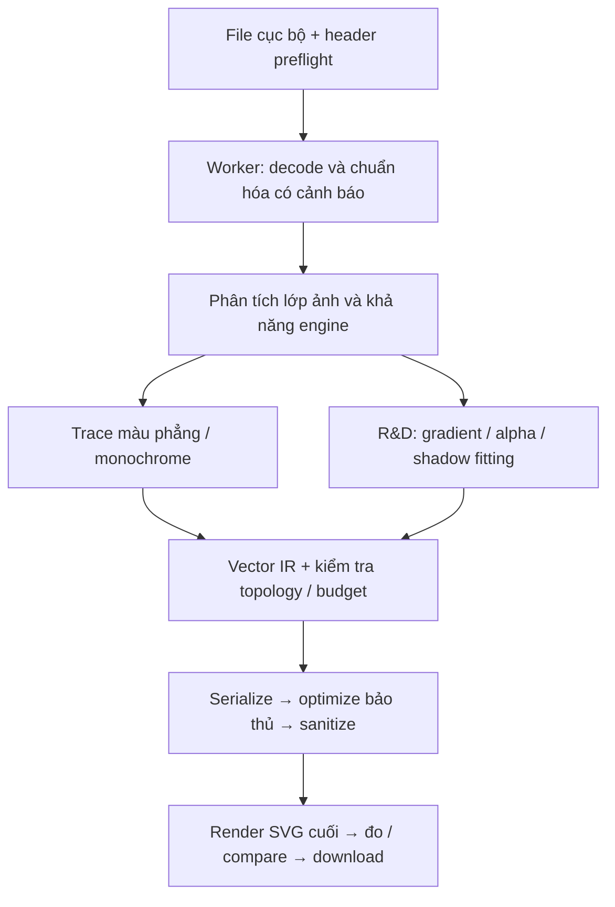

# Báo cáo tổng hợp R&D vector hóa ảnh hoàn toàn trong trình duyệt

**Nên tiếp tục dự án với mục tiêu SVG có độ trung thực cao và phạm vi chất lượng được kiểm chứng. Không thể cam kết mọi ảnh chụp cho SVG nhỏ, đẹp, giống tuyệt đối; cũng không thể phục hồi duy nhất SVG gốc chỉ từ PNG/JPG bất kỳ.** Gradient, bóng và alpha mềm có cách biểu diễn bằng SVG chuẩn, nhưng chưa có bằng chứng rằng một engine sẵn dùng trong browser giải quyết trọn vẹn việc tự động tái dựng chúng cho mọi illustration.

Báo cáo này cập nhật kết luận kỹ thuật của [nghiên cứu ban đầu](/Users/dongnt/Desktop/github/svg/docs/research/browser-vectorization-feasibility.vi.md), đối chiếu nguồn đến **14/09/2026**. Phạm vi bắt buộc: xử lý trên thiết bị, không gọi API chuyển đổi/model/analytics trong luồng chuyển đổi; tài nguyên ứng dụng tự host; SVG tự chứa, không nhúng raster đầu vào và không đòi renderer neural riêng khi mở file.

## 1. Kết luận theo từng yêu cầu

| Yêu cầu | Quyết định | Căn cứ và giới hạn |
| --- | --- | --- |
| Giữ rất sát logo và nhiều mảng màu rõ | **Khả thi có điều kiện; ưu tiên triển khai** | Có engine browser và phép thử nhỏ thành công. Chưa chứng minh corpus logo thực, chữ nhỏ, mọi topology hoặc mọi browser |
| Giữ rất sát illustration có gradient, bóng, alpha mềm | **Có cơ sở kỹ thuật; cần R&D trước cam kết chất lượng** | SVG chuẩn biểu diễn được; nghiên cứu có kết quả. Chưa có pipeline browser đã được kiểm chứng end-to-end cho toàn bộ nhóm |
| Ảnh chụp bất kỳ → SVG nhỏ, đẹp, giống tuyệt đối | **Không khả thi như một bảo đảm tổng quát trong ngân sách nhỏ** | Giới hạn thông tin khi độ phức tạp đầu vào không bị giới hạn; “đẹp” và “giữ mọi noise” còn có thể xung đột |
| Phục hồi đúng SVG gốc từ PNG/JPG bất kỳ | **Không khả thi như một phép phục hồi duy nhất** | Có hai nguồn SVG khác nhau tạo cùng raster; đã kiểm tra phản ví dụ trong browser |
| Chuyển đổi hoàn toàn trong browser, không API | **Khả thi; đã kiểm tra trong phạm vi nhỏ** | Hai engine chạy trong worker khi network bị đặt offline sau khi tải asset; chưa kiểm thử toàn ứng dụng hoặc toàn ma trận thiết bị |
| Mọi khoảng trống khác đã được giải quyết? | **Chưa** | Đã lập danh mục vấn đề, quyết định và tiêu chí kiểm chứng; hiệu năng mobile, giới hạn RAM, importer và nhiều biến thể ảnh vẫn phải thử |

“Không khả thi” ở hai yêu cầu tuyệt đối không có nghĩa không thể tạo một SVG rất giống cho một ảnh cụ thể. “Khả thi có điều kiện” cũng không có nghĩa chất lượng sản phẩm đã được chứng minh.

## 2. Mức độ bằng chứng

| Mức | Ý nghĩa | Ví dụ trong báo cáo |
| --- | --- | --- |
| **Đã chạy** | Kết quả của thí nghiệm được lưu, có cấu hình và giới hạn | Probe sáu fixture; phản ví dụ hai SVG |
| **Đã đối chiếu nguồn** | Nội dung của chuẩn, paper hoặc code đã đọc | VTracer serializer bỏ alpha; SGLIVE flatten trên trắng |
| **Suy luận** | Kết luận có lập luận, với giả thiết nêu rõ | Không thể xác định SVG gốc từ đầu vào không phân biệt được |
| **Đề xuất kỹ thuật** | Cách xây và điều kiện nghiệm thu, chưa triển khai | IR gradient/alpha, fitting theo residual, budget runtime |
| **Chưa kiểm chứng** | Chưa có phép chạy hoặc artifact đủ để kết luận | Chất lượng corpus thực, tốc độ điện thoại, browser port của paper |

Không dùng điểm SSIM làm phần trăm chính xác; không biến thời gian trên A100/L40S/RTX thành dự báo browser; không lấy sự tồn tại của `<path>` làm bằng chứng file dễ chỉnh sửa. License bài báo, code, dữ liệu và trọng số phải được xét riêng. Mọi số thử nghiệm trong phần 3 đều có nguồn dữ liệu cục bộ; không có số đo chất lượng ảnh chụp hay benchmark mobile được suy đoán.

## 3. Bằng chứng thực nghiệm bổ sung

### 3.1 Chuyển đổi khi network bị đặt offline

Probe chạy trên **Chrome 152, macOS**, sáu fixture tự tạo **256 × 256**. Hai worker tải VTracer qua adapter WASM của RasterTrace và ImageTracerJS 1.2.6 từ localhost; sau đó đặt browser context offline rồi mới tạo các ảnh PNG/JPEG mới, decode, trace và render lại SVG. VTracer dùng artifact có hash khớp snapshot đã ghi ở báo cáo đầu. Không chạy bước nhị phân hóa alpha của ứng dụng RasterTrace.

Hai cấu hình có budget khác nhau và chưa tune, vì vậy đây là phép chẩn đoán, không phải bảng xếp hạng engine. Cấu hình VTracer ban đầu là `spline/cutout`, speckle 0, color precision 8, layer difference 0. ImageTracer dùng sampling xác định, 64 màu yêu cầu và không stroke. Toàn bộ tham số, UA và phép tính nằm trong [JSON kết quả](/Users/dongnt/Desktop/github/svg/docs/research/experiments/browser-probe-results.json).

| Fixture | VTracer trong cấu hình thử | ImageTracerJS trong cấu hình thử | Kết luận được phép rút ra |
| --- | --- | --- | --- |
| PNG gồm ba mảng chữ nhật đục | 3 path, 673 byte, 0 pixel RGBA khác | 3 path, 581 byte, 0 pixel RGBA khác | Một số hình phẳng có thể tái tạo đúng ở kích thước thử |
| JPEG của cùng hình | 33 path, 2.765 byte; 4 pixel RGBA khác | 9 path, 1.575 byte; 1.916 pixel RGBA khác | Decode JPEG và trace local hoạt động; không suy ra chất lượng mọi JPEG |
| Nét mảnh, lỗ và đường tròn | 278 path, 23.936 byte | 138 path, 19.190 byte | Cần thêm đo topology/ROI; độ phức tạp tăng rõ so với hình chữ nhật |
| Gradient xám tuyến tính | 158 path; không native gradient; sai lệch lớn | 159 path; không native gradient; có sai lệch | Hai cấu hình này chưa tái dựng gradient phù hợp |
| Vùng đỏ alpha 128/255 | 1 path; alpha trung tâm thành 255 | 2 path; đúng RGBA trên mẫu này | Alpha đồng nhất đã là trường hợp phải phân biệt engine |
| Alpha radial mềm | 3.422 path, 331.064 byte; alpha MAE 0,39701 | 1.638 path, 271.602 byte; alpha MAE 0,01523 | Có opacity không đồng nghĩa alpha biến thiên được tái dựng gọn và đúng |

Alpha MAE tính toàn ảnh, miền 0–1; số 0,01523 không phải “sai 1,523% về mọi khía cạnh”. RMSE và số pixel đổi không thay cho đánh giá hình học. Cả hai engine từ chối blob PNG hỏng ở browser decoder; đây không phải kiểm thử đầy đủ worker crash, OOM hoặc lỗi nội bộ engine.

Đã chạy thêm VTracer `stacked` để kiểm tra ảnh hưởng của hierarchy. Mẫu alpha đồng nhất vẫn đổi từ 128 sang 255; alpha radial vẫn sai; gradient tuyến tính vẫn có lỗi lớn. Số path thay đổi đáng kể, ví dụ mẫu radial còn 556 path. Do vậy không thể chốt preset từ tên chế độ hoặc số path. Chưa xác định nguyên nhân lỗi gradient nằm ở core, adapter hay tổ hợp tham số; đây là một issue cần cô lập, không phải kết luận mọi bản VTracer đều xử lý gradient giống nhau. [Kết quả stacked](/Users/dongnt/Desktop/github/svg/docs/research/experiments/browser-probe-stacked-results.json).

**Giới hạn:** chưa optimize/sanitize bằng pipeline sản phẩm, chưa so ngân sách công bằng, chưa có ảnh thật, chưa kiểm thử reload offline, Safari/Firefox/mobile, cancel hoặc peak memory. Các thời gian đơn lẻ trong JSON chỉ để truy vết, không dùng làm SLO. [Source và hướng dẫn tái lập](/Users/dongnt/Desktop/github/svg/docs/research/experiments/README.md).

### 3.2 Hai SVG khác nhau tạo cùng PNG/JPEG

SVG A có rectangle đỏ. SVG B có thêm circle xanh nằm dưới rectangle đỏ đục và bị che hoàn toàn. Hai source hash khác nhau, nhưng kết quả chạy cho thấy:

| Kích thước render | Thành phần RGBA khác nhau | Byte PNG khác nhau | Byte JPEG khác nhau |
| --- | ---: | ---: | ---: |
| 64 × 64 | 0 | 0 | 0 |
| 128 × 128 | 0 | 0 | 0 |
| 256 × 256 | 0 | 0 | 0 |

Mỗi cặp được encode trong cùng browser và cùng tham số; không khẳng định encoder khác nhau sẽ tạo cùng chuỗi nén. Bằng chứng vẫn đủ: tồn tại hai SVG nguồn khác nhau dẫn tới đúng cùng file đầu vào cho một bộ phục hồi. [Fixture](/Users/dongnt/Desktop/github/svg/docs/research/evidence/original-svg-collision.html), [JSON và hash](/Users/dongnt/Desktop/github/svg/docs/research/evidence/original-svg-collision-result.json).

## 4. Gradient, bóng và alpha mềm

### Điều có thể biểu diễn

SVG chuẩn có gradient tuyến tính/xuyên tâm, `stop-opacity`, mask và filter như Gaussian blur. Một bóng được mô tả bằng path và filter không nhúng PNG/JPG nguồn. Tuy nhiên renderer thường dùng buffer raster trung gian để tính filter; loại SVG này không tương đương file chỉ gồm outline cho máy cắt. Phải định nghĩa profile xuất và kiểm tra importer mục tiêu. [W3C Paint Servers](https://www.w3.org/TR/SVG2/pservers.html), [Filter Effects](https://www.w3.org/TR/filter-effects-1/).

Nên tách ba vấn đề: fitting gradient màu; giữ alpha cuối của PNG; suy ra các layer ban đầu. PNG RGBA cung cấp trường alpha cuối, nhưng không cho biết các layer đã tạo nó. JPEG đã flatten còn mất thông tin tách foreground và nền.

Theo source-over trên nền đục, `C = αF + (1−α)B`. Trên nền trắng, đen với alpha 0,75 và xám 0,25 đục đều cho C=0,25; đổi sang nền đen thì hai kết quả khác nhau. Do đó một ảnh đã flatten không xác định duy nhất foreground/alpha. Đây là suy luận trực tiếp từ mô hình compositing. [W3C Compositing](https://www.w3.org/TR/compositing-1/#simplealphacompositing).

### Điều nghiên cứu hiện có thực sự chứng minh

| Hướng | Bằng chứng | Phần chưa giải quyết cho dự án |
| --- | --- | --- |
| Gradient Reconstruction, Eurographics 2025 | Tự phân vùng và fit solid/linear/radial; paper dùng trường RGB | Không chứng minh alpha end-to-end hoặc layer decomposition; chưa có browser engine đã kiểm chứng |
| Linear Gradient Layer Decomposition, SIGGRAPH 2023 | Source xuất `linearGradient` và `stop-opacity` | Cần segmentation đầu vào; reference native; license toàn dự án chưa xác minh |
| SGLIVE, ECCV 2024 | Radial-gradient vectorization và code Apache-2.0 | Source composite RGBA trên trắng trước tối ưu; không thể coi là bảo toàn alpha nguồn |
| COVec / Clair Obscur | Tách albedo/shade/light; paper mô tả SVG native với multiply và plus-lighter | Reference Python/native; cần thử file xuất thật trên browser và editor, cùng quy tắc blend/color |

Các nguồn tương ứng: [Gradient Reconstruction](https://research.adobe.com/publication/image-vectorization-via-gradient-reconstruction/), [Layer Decomposition code](https://github.com/Zhengjun-Du/ImageVectorViaLayerDecomposition), [SGLIVE source](https://github.com/Rhacoal/SGLIVE/blob/main/SGLIVE/main.py), [COVec Appendix B](https://arxiv.org/html/2511.20034v2).

**Đề xuất triển khai:** bắt đầu fitting solid/linear/radial ở vùng đã biết mask để tách lỗi fitting khỏi segmentation. Sau đó mới tự tìm vùng; tối ưu theo lỗi premultiplied RGB, alpha, biên và chi phí path/stop. Với màu và alpha khác cấu trúc, thử mask vector riêng. Chỉ nhận diện Gaussian shadow trong lớp hiệu ứng hẹp đã định nghĩa; glow/texture không fit được phải báo xấp xỉ hoặc ngoài phạm vi, không tự nhúng ảnh.

**Quyết định:** khả thi có điều kiện với các primitive/mẫu đơn giản; đủ cơ sở xây POC. Chưa đủ bằng chứng để viết vào tính năng đã bảo đảm rằng mọi illustration có gradient/alpha mềm sẽ được giữ rất sát. Không cam kết khôi phục alpha/layer gốc từ JPEG đã flatten. [Phân tích đầy đủ](/Users/dongnt/Desktop/github/svg/docs/research/rd-gradient-alpha.vi.md).

## 5. Ảnh chụp bất kỳ, độ gọn và độ chính xác

**Suy luận giới hạn thông tin:** với n pixel RGB 8-bit, có `2^(24n)` bộ mẫu có thể phân biệt. Chỉ có `2^(B+1)−1` chuỗi tối đa B bit. Nếu `B < 24n`, số chuỗi ít hơn số ảnh; dưới renderer cố định, luôn có ảnh không thể được biểu diễn chính xác trong budget đó. Thêm primitive, filter hoặc số thập phân dài không làm chi phí lưu thông tin biến mất. Đếm path mà bỏ số segment, chữ số hay dữ liệu ngoài sẽ đánh giá sai độ gọn.

Lập luận này áp dụng cho miền mẫu không hạn chế độ phức tạp; không chứng minh mọi bức ảnh tự nhiên đều khó nén. Một ảnh chụp nền trơn có thể có SVG rất gọn. Nhưng “bất kỳ” mà vẫn giữ toàn bộ noise/texture không tạo cơ sở cho bảo đảm nén nhỏ, không sai số. “Đẹp” cũng phải có rubric và có thể yêu cầu bỏ bớt những gì yêu cầu pixel equality bắt giữ lại.

Có thể dùng một ô vector cho mỗi pixel để mô tả mẫu trong điều kiện render phù hợp. Cách đó không khôi phục đường cảnh gốc, có thể rất lớn và khó chỉnh đối tượng. Vì vậy không được nói “SVG không thể biểu diễn raster”; phải nói đúng rằng bộ yêu cầu **mọi ảnh + budget nhỏ + chính xác tuyệt đối** không được bảo đảm.

Nghiên cứu mới cải thiện chất lượng hoặc cấu trúc theo budget, chưa loại bỏ phép đánh đổi này:

- **SuperSVG** có pipeline và số đo trên GPU; dùng Python/PyTorch/DiffVG. Điểm đánh giá vẫn là sai số xấp xỉ, không là chứng minh lossless. [Paper](https://arxiv.org/html/2406.09794v1).
- **Vector Scaffolding** phân bổ thêm đường theo residual; paper dùng A100 và 5.000 vòng tối ưu. Đây là cơ sở cho refinement có budget, không phải tốc độ browser. [Paper](https://arxiv.org/html/2605.11913v1).
- **VectorArk** còn nêu giới hạn gradient/filter/transparency; tại thời điểm kiểm tra trang tác giả chưa phát hành code. [Paper](https://arxiv.org/html/2605.24398v1), [project](https://vectorark.github.io/).
- **AmodalSVG** suy đoán phần bị che bằng segmentation/inpainting và nhiều model lớn. Có đối tượng đầy đủ hơn không chứng minh phần được dựng chính là phần gốc. [Paper](https://arxiv.org/html/2604.10940v1).

Gradient mesh hoặc neural texture có thể biểu diễn hiệu ứng phong phú, nhưng cần xác minh file cuối là SVG browser tự chứa. Renderer riêng, embedding feature/MLP hoặc raster fallback không tự đáp ứng yêu cầu. Riêng COVec có mô tả blend SVG native, nên cần kiểm chứng đường xuất đó thay vì loại toàn bộ phương pháp chỉ vì reference tối ưu dùng renderer riêng.

**Quyết định:** có thể thiết kế chế độ ảnh chụp xấp xỉ/cách điệu có budget byte, segment và thời gian. Khi residual vẫn quá lớn ở vùng quan trọng, phải hiển thị hạn chế. Không cam kết SVG nhỏ hơn JPG gốc, không sai pixel, hoặc dựng đúng chi tiết ngoài độ phân giải nguồn. [Phân tích và đối chiếu các công trình](/Users/dongnt/Desktop/github/svg/docs/research/rd-photographs.vi.md).

## 6. Phục hồi đúng SVG gốc

Cần phân biệt đúng byte XML, đúng cấu trúc/ngữ nghĩa, tương đương khi render và tái dựng hợp lý. Một hình có thể được viết bằng `<rect>` hoặc path; tên layer/comment không hiện trong pixel; đối tượng bị che có thể tồn tại hoặc không. Những khác biệt đó khiến việc suy ra nguồn không duy nhất ngay cả khi ảnh rất sắc nét.

Gọi R là phép render. Phản ví dụ ở phần 3 có `A ≠ B` nhưng `R(A)=R(B)=I`. Một thuật toán chỉ nhận I không thể đồng thời luôn trả A khi nguồn là A và B khi nguồn là B. Thuật toán ngẫu nhiên/AI cũng không có tín hiệu phân biệt. Đây là giới hạn thông tin; không phụ thuộc bộ nhớ browser hoặc sức mạnh GPU.

StarVector, OmniSVG và RLRF có thể tạo cấu trúc hợp lý hơn hoặc tận dụng feedback ảnh render. Chúng không quan sát được thông tin đã bị loại khỏi ảnh. Source Python/CUDA hoặc checkpoint lớn cũng chưa là thư viện browser. [StarVector](https://github.com/joanrod/star-vector), [OmniSVG](https://arxiv.org/html/2504.06263v3), [RLRF](https://arxiv.org/html/2505.20793v2).

Ngoại lệ có thông tin bổ sung gồm PNG chứa nguyên payload SVG, có backup, hoặc thư viện hữu hạn đã biết mà phép xuất ảnh được chứng minh phân biệt mọi ứng viên. Đây là trích xuất/truy hồi có điều kiện, không phải đảo raster phổ thông. Payload SVG lấy từ metadata vẫn cần kiểm tra và sanitize; sau khi sửa markup thì không còn là byte nguyên bản.

**Quyết định:** loại “khôi phục đúng SVG gốc từ mọi PNG/JPG” khỏi đặc tả. Giữ “tạo SVG mới có thể chỉnh sửa, gần hình nguồn”. Nếu sau này hỗ trợ OCR, nhận dạng primitive hoặc metadata, phải đặt tên đúng theo nguồn bằng chứng. [Chứng minh và ngoại lệ đầy đủ](/Users/dongnt/Desktop/github/svg/docs/research/rd-original-svg.vi.md).

## 7. Logo và nhiều mảng màu rõ

Đây là nhóm nên ưu tiên vì thường có ít màu hữu ích, biên tương đối rõ và mô hình hình học đơn giản hơn texture ảnh chụp. Tuy nhiên nền anti-alias có thể tạo hàng trăm màu rìa, JPEG có thể sinh vùng nhỏ và chữ có dấu dễ mất chi tiết. Mẫu ba rectangle đã chạy chứng minh một trường hợp hẹp; không chứng minh chữ, curve, lỗ hoặc logo bất kỳ.

**Pipeline đề xuất:** giữ bản decode tham chiếu, xác định vùng màu liên thông, chọn palette có kiểm soát, phân biệt biến thiên do biên với màu nội dung, tạo biên chung, fit curve và bảo vệ góc/lỗ/nét nhỏ. Đánh giá cả chênh màu ở vùng nội thất và sai số biên. Không áp dụng binary tracing cho ảnh màu nếu người dùng không chọn monochrome. Không tự biến nền trắng trong artwork thành trong suốt.

Potrace là ứng viên monochrome; core GPL và wrapper phải được xét riêng. ImageTracerJS có đường JS vào browser và khả năng opacity, nhưng cần kiểm thử độ mượt/topology. VTracer có cả stacked/cutout và pipeline mới; kết quả thực cho thấy hai chế độ có số path và sai lệch khác nhau, chưa đủ căn cứ chọn một mặc định chung. [Potrace](https://potrace.sourceforge.net/), [ImageTracerJS](https://github.com/jankovicsandras/imagetracerjs), [VTracer](https://github.com/visioncortex/vtracer).

Topology của các vùng kề nhau đúng về hình học chưa chắc render không có đường nối: antialias, draw order, opacity và coordinate rounding có thể làm lộ nền. Ngược lại, dùng overlapping shapes che khe có thể làm sai màu ở vùng bán trong suốt. Kiểm thử phải bao gồm nền trắng/đen và 1×/2×/4×, cùng lỗ và thành phần liên thông, không chỉ kiểm tra XML.

Text tracing cho ra hình chữ, không phục hồi font hoặc nội dung text có thể sửa. OCR/primitive recognition chỉ là lựa chọn ước lượng nếu sau này thêm; không được thay silhouette đã đúng bằng hình tròn/rectangle “đẹp hơn” khi residual tăng ngoài ngưỡng.

**Quyết định:** triển khai sau POC với corpus logo thật và fixture adversarial; chỉ hứa độ trung thực cao cho lớp ảnh đã đạt tiêu chí. [Chuyên đề logo và màu phẳng](/Users/dongnt/Desktop/github/svg/docs/research/rd-logos-flat-art.vi.md).

## 8. Ma trận lựa chọn engine và hướng R&D

| Lựa chọn | Browser hiện tại | Paint/đầu ra có bằng chứng | License/readiness | Vai trò |
| --- | --- | --- | --- | --- |
| VTracer alpha.4 qua adapter | Đã chạy worker offline trong probe | RGB solid; alpha mềm thất bại trên mẫu thử; adapter cần chuẩn hóa viewBox | Core có MIT/Apache lựa chọn; pin artifact; alpha release | Ứng viên POC, chưa chốt duy nhất |
| ImageTracerJS 1.2.6 | Đã chạy worker offline trong probe | Solid/opacity; đúng một mẫu alpha đồng nhất, chưa gọn với alpha radial | Unlicense; phiên bản/hoạt động thuật toán cũ | Baseline và ứng viên theo nhóm ảnh |
| Potrace WASM | Có browser port; chưa chạy trong probe này | Core monochrome; posterization wrapper không phải gradient reconstruction | Kiểm tra GPL/core/port cụ thể | Nhánh monochrome nếu phù hợp license |
| Img2Num 0.4.2 | Có browser ESM/WASM; chưa chạy ở đây | Source serializer RGB solid/path; chưa opacity/gradient/viewBox | Core/package MIT; docs/example có license riêng | Challenger mới cho POC, đặc biệt ảnh cách điệu |
| Gradient Reconstruction / Layer Decomposition / SGLIVE | Reference paper/native | Có hướng gradient thật; điều kiện alpha khác nhau | Artifact/license phụ thuộc công trình | Nghiên cứu fitting, không cài như browser SDK |
| COVec | Native/PyTorch, chưa browser inference | Paper mô tả SVG với blending native | Repo Apache-2.0; xét dependency riêng | R&D shading và export compatibility |
| VLM/diffusion tạo SVG | Chưa kiểm chứng port browser đáp ứng budget | Tái dựng plausible, không nguyên bản | Model/code/data có điều kiện riêng | Chưa làm phụ thuộc bắt buộc |

Img2Num là bổ sung mới so với báo cáo đầu. Bản phát hành có browser build, nhưng blog 0.4.2 mô tả WebGPU optional hiện tại ở Node và việc mở rộng acceleration còn đang nghiên cứu. **Không ghi browser WebGPU đã được chứng minh.** Serializer ở snapshot được đọc chỉ xuất RGB/path, vì vậy không giải alpha/gradient chỉ bằng cách thay engine. [Release chính thức](https://img2num.dev/blog/img2num_js_0_4_2/), [source serializer đã pin](https://github.com/Ryan-Millard/Img2Num/blob/27eda01d7c52b200114f95a666ff134c4bb5fb67/core/src/internal/labels_to_svg.cpp#L175-L196).

Đã đo browser artifact Img2Num 0.4.2: JS 106.905 byte, WASM 540.053 byte; gzip tính cục bộ lần lượt 24.131 và 165.101 byte. Đây là dữ liệu tải, không phải peak memory, tốc độ hay chất lượng. Source, phương pháp và hash có trong [bằng chứng artifact](/Users/dongnt/Desktop/github/svg/docs/research/rd-photographs-artifacts.json). Không lấy kích thước npm unpacked hoặc byte source chưa minify để xếp hạng hiệu quả công bằng.

## 9. Thiết kế kỹ thuật bổ sung

Các mục dưới đây là **đặc tả đề xuất đã cập nhật theo bằng chứng**, chưa phải tính năng được cài vào ứng dụng. Giữ Next.js/React/TypeScript/Tailwind/ShadCN/Base UI/pnpm của dự án; chưa thêm dependency conversion hay đổi kiến trúc ứng dụng.

### 9.1 Ranh giới xử lý và state

Không thêm route `/api/convert`, Server Action nhận ảnh hoặc model endpoint. Code/WASM tự host và có version; ảnh/buffer ở local, không cache trong service worker. Tách trạng thái `validating`, `decoding`, `tracing`, `checking`, `ready`, `cancelled`, `failed`. `ready` chỉ khi có file SVG hợp lệ và download được; kết quả này không tự có nghĩa đã vượt một ngưỡng tương đồng chưa đo.

Mỗi job có ID, giới hạn và warning riêng. Abort bằng terminate worker khi lời gọi WASM đồng bộ không trả quyền điều khiển. Không giả vờ message cancel luôn ngắt được vòng native ngay. Khi engine không cung cấp tiến độ nội bộ, hiển thị stage và indeterminate đúng thực tế. Tạo lại worker sạch sau cancel/error thay vì dùng heap đang có trạng thái không rõ. [Worker.terminate](https://developer.mozilla.org/en-US/docs/Web/API/Worker/terminate).

### 9.2 Adapter phải khai báo khả năng

Adapter cần mô tả rõ hỗ trợ monochrome/màu, binary alpha/continuous alpha, solid/gradient, cutout/stacked, stage progress, giới hạn và môi trường. `supportsOpacity` không được suy ra thành `preservesSoftAlpha`. Khả năng nên gắn version cùng fixture kiểm chứng; chưa kiểm chứng phải mang trạng thái đó.

Các kiểm tra đầu vào/output nằm ngoài React. Nếu adapter chỉ trả chuỗi SVG sau cùng, app khó ngắt sớm khi graph/path nở quá lớn. POC cần xác định điểm đặt budget vào core hoặc stage; nếu không có thì giới hạn input thận trọng và watchdog chỉ là biện pháp giảm rủi ro, không là bảo đảm tuyệt đối chống OOM.

### 9.3 IR màu, alpha và profile SVG

IR nên phân biệt `SolidPaint`, `LinearGradientPaint`, `RadialGradientPaint`; chứa màu, alpha, stop, units và transform rõ ràng. Dữ liệu hình học có subpath, winding/fill rule, topology và thứ tự vẽ. Giữ alpha cuối nguồn làm mục tiêu độc lập; không flatten trắng trong pipeline rồi gắn opacity sau.

Đề xuất profile đầu ra:

| Profile | Cho phép | Chưa được suy diễn |
| --- | --- | --- |
| **Vector cơ bản** | Path/shape, solid fill, opacity, clipPath nội bộ | Không hứa tìm lại primitive/layer nguyên bản |
| **Vector gradient** | Thêm linear/radial gradient và stop-opacity | Không hứa mesh/airbrush bất kỳ |
| **Vector hiệu ứng** | Mask vector, filter/blend nằm trong allowlist nhỏ | Không coi mọi editor/máy cắt đều hỗ trợ; phải đo render |

Cả ba cấm raster `<image>`/`<feImage>`, external URL, script, event handler, `foreignObject` và renderer tùy biến cần thiết để đọc file. Không chuyển ngầm sang profile mất hiệu ứng. `viewBox`, coordinate units, filter bounds, interpolation và paint order phải được kiểm tra sau tối ưu.

Không đặt `DOMParser`/DOMPurify trực tiếp trong Dedicated Worker như thể có DOM. Một phương án là validate IR và complexity trong worker, rồi sanitize SVG đã giới hạn kích thước ở main thread; phương án khác cần parser/sanitizer không DOM được kiểm chứng riêng. Phép thử hiện tại dùng DOMParser ở main thread và chỉ xử lý dữ liệu tổng hợp do harness tạo, chưa chứng minh an toàn đầu vào sản phẩm. [WHATWG DOMParser](https://html.spec.whatwg.org/multipage/dynamic-markup-insertion.html#the-domparser-interface), [DOMPurify](https://github.com/cure53/DOMPurify).

### 9.4 Chính sách màu và chất lượng nguồn

Cần định nghĩa decode/reference color space, EXIF orientation, bit depth và premultiplication. PNG 16-bit/wide-gamut đưa vào RGBA8 sRGB có thể thay đổi dữ liệu trước tracing. Browser canvas cũng có chuyển màu và phép đổi premultiplied alpha; vì vậy “Maximum” không được hiểu là bảo toàn byte/pixel mọi nguồn và mọi browser. [HTML Canvas pixel manipulation](https://html.spec.whatwg.org/multipage/canvas.html#pixel-manipulation), [PNG specification](https://www.w3.org/TR/png-3/).

Khi cần normalize/downscale/denoise, ghi warning và mức tác động; không tự downscale ở Maximum mà vẫn giữ lời hứa giống tuyệt đối. Với ảnh đã flatten, background removal là ước lượng riêng; không gọi là phục hồi transparency gốc. Các browser/codec khác nhau phải so theo reference decode đã quy định, không trộn mọi khác biệt vào điểm lỗi tracer.

### 9.5 Chất lượng, complexity và budget

Đo tối thiểu lỗi RGB composite, alpha, vùng biên/lỗ/chi tiết quan trọng; đồng thời ghi path, subpath, segment/control point, gradient stop, filter area, byte và thời gian từng stage. Không chấm RGB ẩn ở alpha=0 như lỗi nhìn thấy. Nếu có SVG ground truth, render nó ở nhiều mức zoom; giữ ground truth khỏi đầu vào thuật toán.

Giới hạn POC trước đây 10 MiB/4 MP/4.096 px/30 giây chỉ là cấu hình thử đề xuất, **chưa được các phép chạy 256² xác nhận**. Một buffer 4.096² RGBA8 đã cần 64 MiB; tổng RAM còn nhiều buffer và graph. Không gán số pixel “an toàn mọi thiết bị” từ kích thước file nén hoặc WASM maximum memory.

Chạy WASM một luồng trong worker làm baseline. Chỉ bổ sung SIMD/thread/WebGPU khi artifact thật hỗ trợ và đo được lợi ích. Shared memory cần điều kiện isolation; fallback phải được kiểm thử. Optimization như SVGO phải dùng cấu hình giữ hình học/profile, render-diff file cuối; SVGO không thay thế sanitizer. [SVGO browser](https://svgo.dev/docs/usage/browser/), [SharedArrayBuffer](https://developer.mozilla.org/en-US/docs/Web/JavaScript/Reference/Global_Objects/SharedArrayBuffer).

## 10. Danh mục khoảng trống và cách chốt

Danh mục sau bao phủ các điểm chưa rõ đã nhận diện trong hai vòng đánh giá, không khẳng định mọi rủi ro phần mềm đều đã được phát hiện.

| ID | Vấn đề | Trạng thái và việc cần làm |
| --- | --- | --- |
| U01 | Tải/khởi tạo WASM đúng bản | Probe đã chạy; production phải pin binary/glue/hash cùng version, thử stale cache |
| U02 | Node package so với browser package | VTracer cần adapter; Img2Num có browser export; không polyfill `fs` để giả tương thích |
| U03 | MIME/signature/header và ảnh hỏng | Có thử corrupt ở decoder; cần preflight dimension, kiểm tra header độc lập và đối chiếu sau decode |
| U04 | PNG biến thể, JPEG progressive/EXIF/ICC | Chưa đủ fixture; chốt policy định dạng/bit depth/color profile, reject có lý do nếu không hỗ trợ |
| U05 | Decompression bomb/peak RAM | Không có chứng nhận an toàn tuyệt đối; hạn chế byte/dimension/pixel trước decode, thử stress có kiểm soát |
| U06 | Hủy trace đồng bộ | Có cơ chế terminate; chưa chạy cancel engine trong probe này; thử cancel rồi retry và thay file |
| U07 | Worker/WASM lỗi, trap, thiếu asset | Cần fault injection và cleanup; không tạo success khi output thiếu hoặc lỗi |
| U08 | CPU fallback, SIMD/thread/GPU | Phải xác minh build cụ thể; engine trong worker không tự đa luồng/GPU |
| U09 | Offline conversion so với offline reload | Conversion đã chạy offline; cache/reload/install/update chưa thử |
| U10 | Không gọi API/không rò ảnh | Probe offline không đủ chứng minh toàn app; audit cold load, service worker, analytics và error reporting production |
| U11 | Object URL/bitmap/buffer leak | Có cleanup trong fixture; chưa kiểm thử vòng đời sản phẩm/lặp nhiều ảnh |
| U12 | Alpha mềm và anti-alias | Có counterexample thất bại; cần alpha-aware pipeline và metric riêng trên nhiều nền |
| U13 | Gradient/shadow inference | Có cơ sở paper; bắt đầu known-mask fitting rồi end-to-end, chưa nhận là tính năng đạt |
| U14 | Lỗi gradient lớn ở VTracer probe | Lặp cả cutout/stacked vẫn lỗi; cô lập tham số/core/adapter trước chọn engine/preset |
| U15 | Biên chung, winding, lỗ và đường nối | Cần topology tests cùng render; “seam-free geometry” chưa chắc loại mọi artifact rasterization |
| U16 | Palette, speckle và simplification | Khóa tham số theo lớp ảnh, bảo vệ dấu/nét nhỏ; thử ROI và ground truth |
| U17 | `viewBox`, orientation và aspect ratio | VTracer probe thiếu viewBox; adapter phải chuẩn hóa và kiểm tra transform/tọa độ |
| U18 | SVG validate/sanitize | Allowlist theo profile; giới hạn complexity trước preview; cấm raster và tham chiếu ngoài |
| U19 | SVGO/rounding làm đổi kết quả | Render-diff sau optimize và sanitize; không coi ít byte luôn tốt hơn |
| U20 | Mask/filter/blend trong browser/editor | Kiểm tra từng profile trên importer mục tiêu, bounds và chi phí render; chưa có kết quả |
| U21 | Ảnh chụp và semantic grouping | Chỉ xấp xỉ có budget; model grouping/inpainting không bảo đảm đối tượng gốc |
| U22 | Benchmark công bằng | Cùng dữ liệu/renderer/budget hoặc cùng mức lỗi; báo p50/p95 và worst case sau số lần đo đủ |
| U23 | Hiệu năng mobile và giới hạn output | Chưa đo; không dùng throughput desktop/CPU spec suy thành SLO |
| U24 | License/code/checkpoint/dataset | Rà soát từng artifact ở version pin; license dependency không thay license project/model |
| U25 | Khả năng tái lập | Lưu seed/config/compiler/engine/renderer/hash; regression khi nâng phiên bản |
| U26 | Tiến độ và ý nghĩa “thành công” | Hiển thị progress trung thực; valid file khác đạt chất lượng; trạng thái và warning phải tách |

Phân tích chi tiết từng khoảng trống và nguồn tiêu chuẩn nằm trong [chuyên đề các vấn đề còn lại](/Users/dongnt/Desktop/github/svg/docs/research/rd-remaining-gaps.vi.md).

## 11. Kế hoạch triển khai và điều kiện quyết định

| Bước | Công việc cụ thể | Được đi tiếp khi |
| --- | --- | --- |
| 1. Chốt profile và corpus | Xác định logo/illustration/photo mục tiêu, hiệu ứng cho phép, chuẩn màu, editor và thiết bị | Có tiêu chí đo, ảnh holdout và nguồn dữ liệu hợp lệ |
| 2. POC engine đa lựa chọn | VTracer, ImageTracerJS, Img2Num; Potrace nếu chọn monochrome phù hợp license | Chạy local, output hợp lệ, biết lỗi/giới hạn mỗi engine, so budget công bằng |
| 3. POC gradient/alpha bắt buộc | Known-mask fitting, alpha ramp/mask/shadow đơn giản rồi tự segmentation | Vượt baseline màu phẳng ở cùng sai số/complexity; không mất alpha và chi tiết cần giữ |
| 4. Workflow sản phẩm | Upload/validate, worker/cancel, compare, download, warnings, output profiles | Quality gates của repo cùng kiểm thử browser trực quan/e2e hiện hành đạt |
| 5. Stress và offline | Fault injection, nhiều job, mobile, cache version, không network xử lý ảnh | Không có lỗi nghiêm trọng trong ma trận đã công bố; công bố giới hạn đo được |

Nếu bước 3 không đạt với ảnh quan trọng, phải giữ trạng thái “chưa đáp ứng gradient/alpha mềm” hoặc thu hẹp phạm vi có thông báo; không được ra mắt với cùng lời hứa rồi âm thầm lượng tử alpha/nhúng raster. Nếu một bức ảnh cần vượt budget mới đạt chất lượng, phải báo không đạt trong giới hạn hiện tại. Nếu yêu cầu hai cam kết tuyệt đối vẫn bắt buộc, kết luận là **không đáp ứng đặc tả**, không tiếp tục chọn thư viện như thể chỉ thiếu cấu hình.

Chưa có cơ sở để chốt thời hạn hoặc chi phí cho toàn bộ R&D. Các ước lượng lịch ở báo cáo đầu không phải bằng chứng tiến độ; nên ước lượng lại sau khi chốt profile và chạy corpus. Bước tiếp theo cụ thể là triển khai bộ POC theo bảng trên, không phải port ngay một mô hình AI lớn.

## 12. Những kết luận đã được điều chỉnh sau đối chiếu

- **VTracer vẫn là ứng viên, chưa phải engine mặc định đã chọn.** Bằng chứng alpha thất bại và lỗi gradient ở probe buộc giữ bước so sánh/thử nghiệm.
- **SVG có gradient/filter không đồng nghĩa engine đã tìm được gradient/alpha.** SGLIVE giữ gradient trong output nhưng flatten input; phải xét toàn pipeline.
- **Img2Num được thêm vào POC browser CPU/WASM.** Không gắn browser WebGPU như tính năng đã chứng minh; chưa có benchmark chất lượng của dự án.
- **COVec có mô tả SVG blend native.** Giữ như một hướng R&D có đường xuất khả dĩ, với điều kiện kiểm tra renderer/editor; không đồng nhất với neural texture cần decoder riêng.
- **Không còn mơ hồ giữa “chưa có thư viện” và “không thể bảo đảm”.** Hai yêu cầu tuyệt đối có lập luận giới hạn; các phần còn lại có điều kiện và thí nghiệm để quyết định.

## Hồ sơ và nguồn

Các nguồn sơ cấp hỗ trợ kết luận được đặt ngay cạnh nội dung liên quan. Hồ sơ dưới đây giữ các bảng paper, version/license, phép tính và link source chi tiết để kiểm toán từng nhận định:

1. [Gradient, bóng và alpha mềm](/Users/dongnt/Desktop/github/svg/docs/research/rd-gradient-alpha.vi.md).
2. [Ảnh chụp, độ gọn và độ trung thực](/Users/dongnt/Desktop/github/svg/docs/research/rd-photographs.vi.md).
3. [Phục hồi SVG gốc và phản ví dụ](/Users/dongnt/Desktop/github/svg/docs/research/rd-original-svg.vi.md).
4. [Logo và hình nhiều mảng màu rõ](/Users/dongnt/Desktop/github/svg/docs/research/rd-logos-flat-art.vi.md).
5. [Các khoảng trống kỹ thuật còn lại](/Users/dongnt/Desktop/github/svg/docs/research/rd-remaining-gaps.vi.md).
6. [Probe browser: source, cấu hình và giới hạn](/Users/dongnt/Desktop/github/svg/docs/research/experiments/README.md), [cutout](/Users/dongnt/Desktop/github/svg/docs/research/experiments/browser-probe-results.json), [stacked](/Users/dongnt/Desktop/github/svg/docs/research/experiments/browser-probe-stacked-results.json).
7. [Phản ví dụ SVG: kết quả và SHA-256](/Users/dongnt/Desktop/github/svg/docs/research/evidence/original-svg-collision-result.json).

Nguồn nhánh `main`/`master`, release page và model card có thể thay đổi. Trước triển khai phải pin phiên bản thực sự dùng; không chuyển phát biểu trong paper thành tính năng sản phẩm đã được kiểm chứng.
